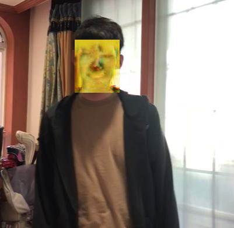

# Using StyleTransfer API and Object Detection Pre-Trained Weights
### Face Tracking and Transfer Face Style with Tensorflow API


## Using Model Links
Tensorflow Hub Style Transfer Model [Link](https://tfhub.dev/google/magenta/arbitrary-image-stylization-v1-256/2)</br> Tensorflow Object Detection MobileNetSSD OpenImage v4 [Link](http://download.tensorflow.org/models/object_detection/ssd_mobilenet_v2_oid_v4_2018_12_12.tar.gz)</br> OpenImage v4 Label Map [Link](https://github.com/tensorflow/models/blob/master/research/object_detection/data/oid_v4_label_map.pbtxt)</br>

## Installaion 
Object Detection Model file must download under model/object_detection Folder </br>
Label Map file download under config Folder
```
conda create -n inference 
conda install tensorflow numpy cv2 tensorflow_hub
```
### Run
```
conda activate inference 

# Input File => Video , Style_image 
# Output File => output
python inference.py

```

